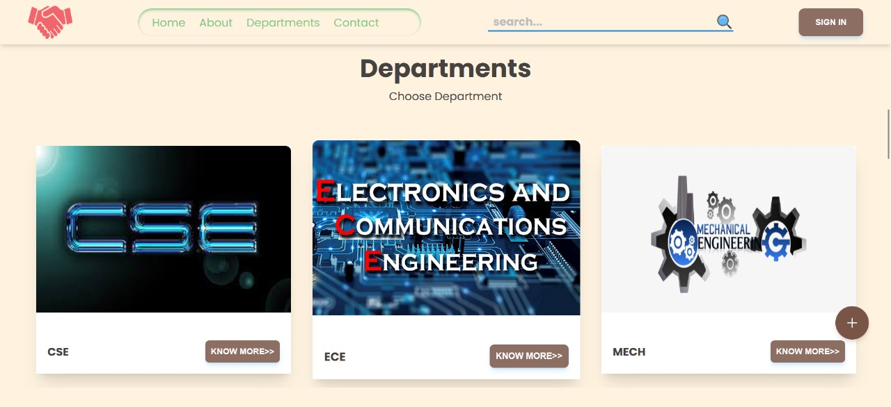
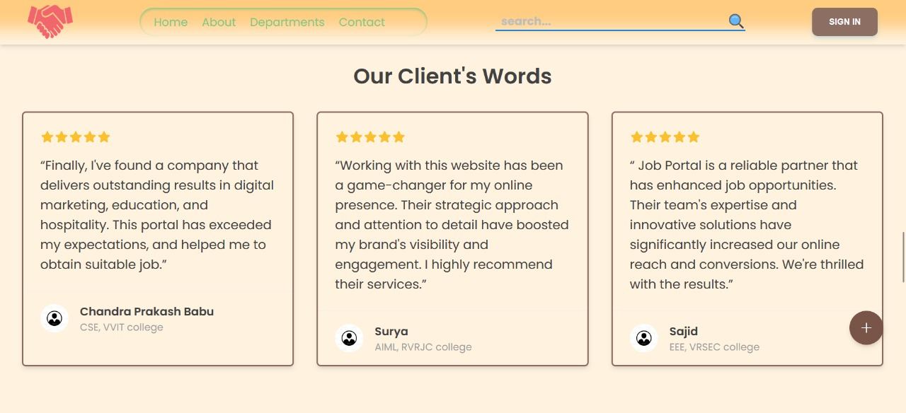

PLACEMENT PORTAL

Stack used: MERN stack :- Mongo DB, Express js, Node js and React js
Styling:Material Tailwind CSS, Tailwind CSS

                                            HERO SECTION

Discover Your Next Career Move with [Job Portal Name]. We connect talented individuals with a wide range of job opportunities from leading companies. Our intuitive platform streamlines the application process, providing personalized job recommendations tailored to your skills and preferences. Start your journey towards a fulfilling career today!. Here, the Routes will be given to the users and they could sign as student, Department coordinator and Admin where each of them have their own functionalities. Calendar is also provided for the future events as an remainder.

Here the slider is used to know about the each companies could be applied to the various companies listed in it. Here the welcome page is also for the user.

Here the departments list is given to the user when they sign in they could register to the companies provided to the each department which is assigned by the admin.

Here the Reviews of the previous job holders are placed and they have suggested some tips to Job Portal and we could provide placement to more students.

It is the sign in page, if the account is created the user can sign in to their respective Admin, Department Coordinator and Student. If not the user may sign up.

The Sign up page have to types of registrations, one is the student sign in the data is verified by the coordinator based on the Roll No and the other is the coordinator sign in is verified by the admin.

                                STUDENT LOGIN

The Department page is maintained by the admin, the student could go to the department and register for the companies provided. The admin could add and delete the departments and Placement events.

The student basic details which are taken during the sign in are taken and registered to the department.

In the Student login, various job companies are displayed from the admin to the student and the registration. The company provides the job description, Deadline to the Registration and cut off CGPA. Based on those the student will be Registering to interview.

The student could register to the placement event and the cut off cgpa is checked and the student could register to it, if student cgpa is less than the cut off cgpa the student gets toast like "rejected due to less CGPA". Else the student is registered to the interview.

Student Profile consists of the basic details which he had given during the registration and the profile photo he could apply and the session of the student is saved the student could edit even his profile.

The student could edit his profile if he had given any wrong credentials during the login and the session will be stored to the server and the credentials are stored in the Mongo DB.

                                DEPARTMENT COORDINATIOR LOGIN

After the interview the student will provide the offer letter to the admin, but the offer letter is checked by the department coordinatior he may approve it if the offer letter is genuine, else he rejects the offer letter and a email will be sent to the student and the texts that re-upload the offer letter.

Here in the above image we could see that the department coordinator is accepted the letter since it is genuine and the admin stores the data of that student that he is placed into a company and package details.

Here the above image specifies that the department coordinator rejects the student offer letter

